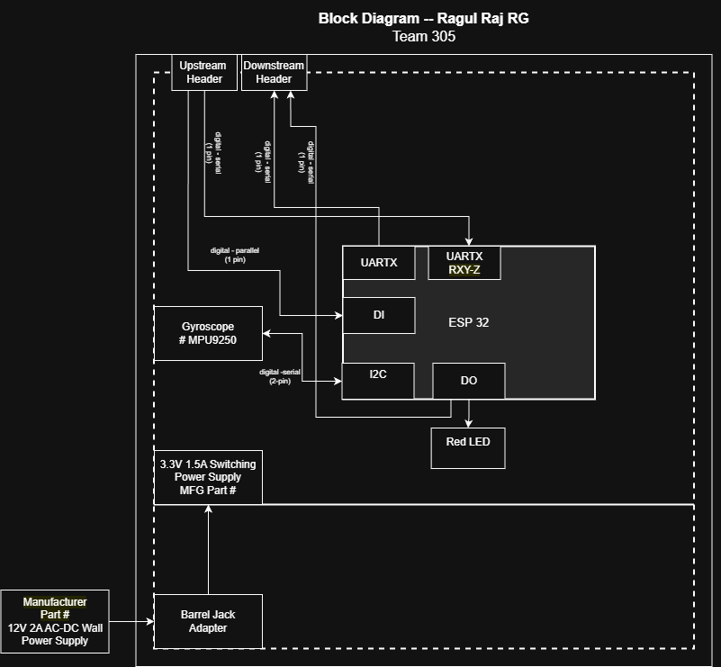

## Block Diagram

This block diagram shows the navigation sensor subsystem for Team 305, featuring an ESP32 as the central processor, an MPU9250 gyroscope interfaced via I2C, upstream and downstream headers for interconnection, a red LED output, and a 12V-to-3.3V power supply chain.

