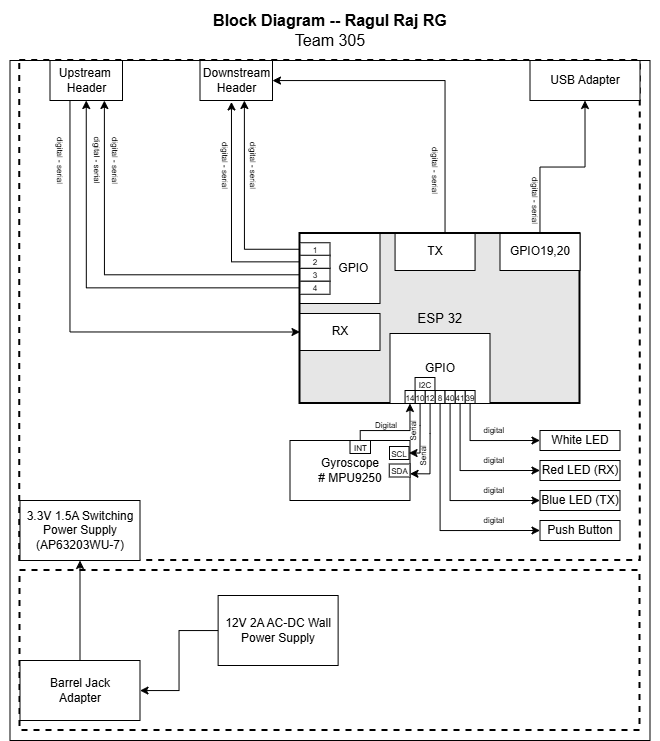

## Block Diagram

This block diagram shows the navigation sensor subsystem for Team 305, featuring an ESP32 as the central processor, an Adafruit LSM9DS1 9-DOF IMU interfaced via I2C, upstream and downstream headers for interconnection, a red LED output, and a 12V-to-3.3V power supply chain.

## Decision-making process

The architecture was developed by working **from the rover interface inward**: the main controller needs orientation data over a simple digital link, the sensor must be rigidly co-located with the MCU on one PCB, and the stack must run from the team’s **12 V** distribution while keeping logic at **3.3 V**. That led to four decisions that shaped the diagram.

1. **Sensing** — A **serial digital IMU** was required; a 9-DOF LSM9DS1 was chosen because it exceeds the minimum “3-axis accelerometer” requirement while adding gyro and magnetometer data for more robust attitude estimation, still using **I²C** as allowed by the requirements.
2. **Processing** — An **ESP32** satisfies the “ESP32 or 8-bit PIC at 3.3 V” constraint, provides hardware **I²C** to the IMU, and offers **UART** for a straightforward connection to the upstream rover controller.
3. **Power** — A **surface-mounted switching regulator** from the 12 V input produces a regulated **3.3 V** domain so every IC (MCU, IMU, support) stays within the single **3.3 V** power requirement.
4. **Integration** — **Upstream/downstream headers** model mechanical and electrical integration with the rest of the rover; a **status LED** gives local confirmation without adding motor control, which this module explicitly does not include.

Together, these choices keep the subsystem focused on **sense → process → report** while staying within the course and team mechanical and electrical interfaces.

## How the block diagram meets product requirements

The [module requirements](../01-Requirements/Requirements.md) are reflected in the blocks and interfaces below.

| Requirement (summary) | How the block diagram addresses it |
| --------------------- | ----------------------------------- |
| Surface-mounted 3.3 V switching regulator | Power chain block: 12 V in → regulated **3.3 V** output for the module. |
| Surface-mounted microcontroller at 3.3 V | **ESP32** as the central processor in the 3.3 V domain. |
| Serial orientation sensor (I²C or SPI) | **LSM9DS1** as the digital sensor; interface shown as **I²C**. |
| Orientation data (X, Y, Z acceleration) | IMU provides acceleration (and gyro/mag) for tilt/orientation. |
| MCU–sensor serial communication | **I²C** link between ESP32 and LSM9DS1. |
| Single 3.3 V power domain | All active logic fed from the same regulated **3.3 V** rail (no mixed-voltage logic). |
| Sensor rigidly mounted / aligned to rover axes | IMU placed on the **module PCB** with fixed orientation relative to the board outline. |
| No motor or motor driver | Diagram contains **no** motor or driver blocks. |
| Data interface to main rover (UART or I²C) | **UART** (and header connectivity) shown for data to the main controller. |
| Fully SMD PCB | Architecture uses **SMD** MCU, IMU, regulator, and passives as intended for the final PCB. |
