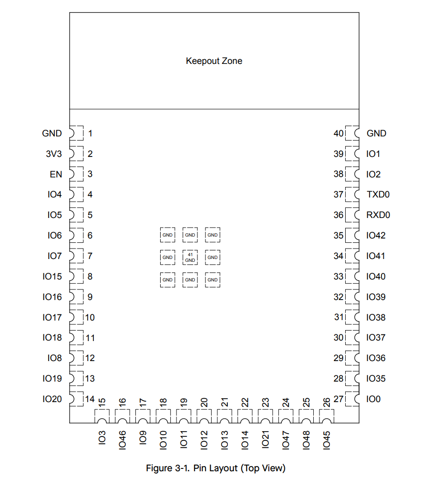

## Project-Specific Requirements

Before selecting a microcontroller, the following project-specific requirements were determined based on the navigation sensor subsystem block diagram:

| Requirement      | Count                            |
| ---------------- | -------------------------------- |
| SPI subsystems   | 0                                |
| UART subsystems  | 1 (teammate communication)       |
| I2C subsystems   | 1 (LSM9DS1 gyroscope)            |
| Power pins       | 2 (3.3V, GND)                    |
| Programming pins | EN, BOOT, TX, RX (USB serial)    |
| GPIO             | 4+ (status LEDs, GPIO8 bring-up, header GPIOs, INT) |
| Communication    | I2C (SDA, SCL), UART (RX, TX)    |

**Total pins needed:** ~14–18 (power, ground, boot/enable, I2C + INT, UART, USB, LEDs, GPIO8, header GPIOs).

## Microcontroller

| Option                  | Advantages                                              | Disadvantages                                      | Cost & Link   |
| ----------------------- | ------------------------------------------------------- | -------------------------------------------------- | ------------- |
| ESP32-S3-WROOM-1-N4     | Built-in Wi-Fi/Bluetooth, supports I2C/SPI/UART, low power modes, 4MB Flash | 3.3V logic may require level shifters for certain peripherals | $2.95 [DigiKey](https://www.digikey.com/en/products/detail/espressif-systems/ESP32-S3-WROOM-1-N4/16162639) |
| ESP8266                 | Affordable, simple to use                               | Limited GPIO pins, lacks dual-core processor       | $1.60 [DigiKey](https://www.digikey.com/en/products/detail/espressif-systems/ESP8266EX/8028401) |
| PIC18F47K42-I/PT             | 8-bit PIC® XLP™ MCU, 128 KB Flash, up to 64 MHz, 36 I/O, ADC/SPI/I²C/UART peripherals | Requires external programmer/debugger, less powerful than higher-end MCUs | $3.50 [DigiKey](https://www.digikey.com/en/products/detail/microchip-technology/PIC18F47K42-I-PT/7561733) |

### ESP32-S3-WROOM-1 Resource Analysis

Research was conducted using the [ESP32-S3-WROOM-1 datasheet](https://documentation.espressif.com/esp32-s3-wroom-1_wroom-1u_datasheet_en.pdf) to compare project needs against available resources:

| Resource | Project Need | ESP32-S3 Available | Status      |
| -------- | ------------ | ------------------ | ----------- |
| I2C      | 1            | 2 controllers      | Exceeds     |
| UART     | 1            | 3 controllers      | Exceeds     |
| GPIO     | 2+           | ~36 (minus flash/PSRAM) | Exceeds |
| Power    | 3.3V         | 3.3V               | Meets       |
| SPI      | 0            | 4 controllers      | Exceeds     |
| ADC      | 0            | 2 SAR ADCs         | Exceeds     |
| PWM      | 0            | LEDC channels      | Exceeds     |

**Resources that meet or exceed needs:** The ESP32-S3-WROOM-1 provides ample I2C (2 controllers vs 1 needed), UART (3 vs 1), and GPIO for the LSM9DS1, interrupt, status LEDs, GPIO8 bring-up, header GPIOs, and teammate UART. Power requirements (3.3V) align with the LM2575-3.3BU regulator. No critical requirements are unmet.

**Resources that exceed needs:** SPI, ADC, and PWM are not required for this subsystem but are available for future expansion. The dual-core processor and Wi-Fi/Bluetooth capabilities also exceed current needs.

**Resources that do not meet needs:** None. All project requirements are satisfied.

## Team Role

I am responsible for the IMU (Inertial Measurement Unit) subsystem on Team 305. My responsibilities include: **Sensing** — integrating and calibrating the LSM9DS1 gyroscope for navigation data; **Actuation** — none; **Display** — status LEDs (TX, RX, debug) for bring-up and visibility; **Power** — ensuring the 3.3V rail from the LM2575-3.3BU regulator is suitable for the ESP32 and LSM9DS1; **Communication** — UART for inter-module communication with teammates, native USB for serial/debug, and I2C plus interrupt from the gyroscope sensor.

## Peripheral Compatibility Research

Compatibility between the ESP32-S3 and LSM9DS1 was verified through online research. The assignment notes that the BNO085 IMU has compatibility issues with ESP32 systems running CircuitPython; the LSM9DS1 is a different device with established support across multiple platforms.

**Libraries and examples:**

- [Adafruit_LSM9DS1 (Arduino)](https://github.com/adafruit/Adafruit_LSM9DS1) — Arduino library for the LSM9DS1; supports I2C and SPI, provides calibrated accelerometer, gyroscope, and magnetometer data.
- [Adafruit CircuitPython LSM9DS1](https://github.com/adafruit/Adafruit_CircuitPython_LSM9DS1) — CircuitPython driver for the LSM9DS1 with full I2C/SPI support.
- [Adafruit LSM9DS1 Tutorial](https://learn.adafruit.com/adafruit-lsm9ds1-accelerometer-plus-gyro-plus-magnetometer-9-dof-breakout/overview) — Wiring diagrams, pinouts, assembly instructions, and example code.

**Interface complexity:** The LSM9DS1 uses I2C (SDA, SCL) with two I2C addresses (one for accel/gyro, one for magnetometer). It requires initialization of both the accelerometer/gyroscope subsystem and the magnetometer subsystem before reading data. This is well-documented through Adafruit's library and tutorial; no low-level library authoring is expected. Both Arduino and CircuitPython have proven support.

## ESP32 Pinout Diagram

The pinout diagram for the ESP32-S3-WROOM-1 surface-mount module is from the [ESP32-S3-WROOM-1 datasheet](https://documentation.espressif.com/esp32-s3-wroom-1_wroom-1u_datasheet_en.pdf) (Pin Layout / Pin Description section).

*Note: Screenshot or extract the Pin Layout / Pin Description figure from the datasheet PDF and save as `esp32-s3-wroom-1-pinout.png` in this directory.*

## Pin usage (from schematic)

The assignments below match the **Team 305 — Gyro_Subsystem** KiCad schematic (`Gyro_Subsystem.kicad_sch`, dated 2026-02-21). GPIO26–32 remain reserved for internal SPI flash on the WROOM module and are not used for peripherals. The rendered schematic and PDFs are on the [Schematic and PCB](../05-Schematic/schematic.md) page.

The **pin allocation table** lists only **major** electrical connections (module, sensor, connectors, indicator LEDs). It does **not** list passives, tactile switches, test points, or similar support items even when they appear on the full schematic.

### Pin allocation table

| ESP32-S3 pin | Schematic function / net | Primary connection |
| ------------ | ------------------------ | ------------------- |
| **EN** | Enable / reset | Chip enable (reset control network) |
| **GPIO0** | Boot strapping | Boot mode selection input |
| **GPIO1** | GPIO1 | Connector **J2** (in) |
| **GPIO2** | GPIO2 | Connector **J2** (in) |
| **GPIO3** | GPIO3 | Connector **J4** (out) |
| **GPIO4** | GPIO4 | Connector **J4** (out) |
| **GPIO8** | Debug / bring-up net | Digital input (subsystem bring-up) |
| **GPIO9** | **SCL** | **I2C clock** — LSM9DS1 (**U2**), header **J5** |
| **GPIO10** | **SDA** | **I2C data** — LSM9DS1 (**U2**), **J5** |
| **GPIO11** | **INT** | Interrupt from LSM9DS1 (**U2**) |
| **GPIO15** | Debug LED | White LED **D4** |
| **GPIO16** | TX LED | Blue LED **D2** |
| **GPIO17** | RX LED | Red LED **D3** |
| **GPIO19** | USB D− | **J1** USB Micro-B (native USB) |
| **GPIO20** | USB D+ | **J1** USB Micro-B |
| **GPIO43** | **RX** | UART receive — **J2** |
| **GPIO44** | **TX** | UART transmit — **J4** |
| **3V3** | +3.3 V | Regulated rail, sensor, connectors |
| **GND** | Ground | Common return |

### Peripheral summary

| Interface or block | Pins | Notes |
| ------------------ | ---- | ----- |
| **Power** | 3V3, GND | Module supply from onboard 3.3 V regulator |
| **I2C (LSM9DS1)** | GPIO9 (SCL), GPIO10 (SDA) | To **U2**; same bus on **J5** |
| **IMU interrupt** | GPIO11 | From **U2** INT |
| **UART** | GPIO43 (RX), GPIO44 (TX) | Header interconnect (**J2** / **J4**) |
| **Native USB** | GPIO19 (D−), GPIO20 (D+) | **J1** Micro-B for firmware and USB serial |
| **Status LEDs** | GPIO15, GPIO16, GPIO17 | White (debug), blue (TX), red (RX) |
| **Digital input** | GPIO8 | Bring-up / test net per schematic |
| **Expansion GPIO** | GPIO1–GPIO4 | **J2** / **J4** |
| **Reset / boot strapping** | EN, GPIO0 | Reset enable and boot mode |

**Pin allocation analysis:** I2C and the IMU interrupt use GPIO9–11, clear of the flash/PSRAM pin block. UART uses GPIO43/44. USB uses the S3 native USB pins on GPIO19/20 to **J1**. **GPIO0** is a strapping pin for boot mode; firmware and reset behavior must keep strapping requirements in mind. Passives, switches, and test hardware are omitted from the tables above but remain on the schematic for implementation.

## Choice

1. ESP32-S3-WROOM-1-N4

    

    * $2.95 each
    * [DigiKey](https://www.digikey.com/en/products/detail/espressif-systems/ESP32-S3-WROOM-1-N4/16162639)

    | Pros                                         | Cons                                                    |
    | -------------------------------------------- | ------------------------------------------------------- |
    | Superior Wi-Fi capabilities                   | 3.3V logic may require level shifters for some peripherals |
    | Dual-core processor for multitasking         |                                                         |
    | Compatibility with I2C and SPI sensor interfaces |                                                      |
    | Low power modes, 4MB Flash                    |                                                         |

**Final Rationale:** The ESP32-S3-WROOM-1-N4 is the optimal choice for the IMU subsystem based on the following data-driven rationale:

- **Meets requirements:** Provides 1 I2C interface to the LSM9DS1 (GPIO9/10) plus INT on GPIO11, 1 UART on GPIO43/44 for header interconnect, native USB on GPIO19/20, status LEDs and GPIO8 bring-up, and 3.3 V operation compatible with the LM2575-3.3BU regulator and LSM9DS1.
- **Exceeds requirements:** Offers 2 I2C controllers, 3 UART interfaces, and abundant GPIO beyond current needs, with dual-core processing and Wi-Fi/Bluetooth for future expansion.
- **Compatibility:** LSM9DS1 has proven Arduino ([Adafruit_LSM9DS1](https://github.com/adafruit/Adafruit_LSM9DS1)) and CircuitPython ([Adafruit CircuitPython LSM9DS1](https://github.com/adafruit/Adafruit_CircuitPython_LSM9DS1)) support; no known major conflicts analogous to BNO085 + CircuitPython.
- **Team coordination:** Per assignment instructions, at least one team member uses an ESP32; this selection fulfills that role.
- **Block diagram alignment:** Serves as the central processor with I2C sensor interface, LED output, and UART for interconnection, matching the navigation sensor subsystem design.

## Post-Approval Checklist

After instructor approval of the microcontroller choice:

- **Microchip samples:** N/A — ESP32 selected; PIC teammates may order free samples from Microchip (avoid BGA, QFN, flip chips for Peralta Labs).
- **MPLabX / MCC / Melody:** N/A — required for PIC only.
- **ESP32:** Pinout matches the Gyro_Subsystem schematic above; order ESP32-S3-WROOM-1 modules as needed for lab builds.
