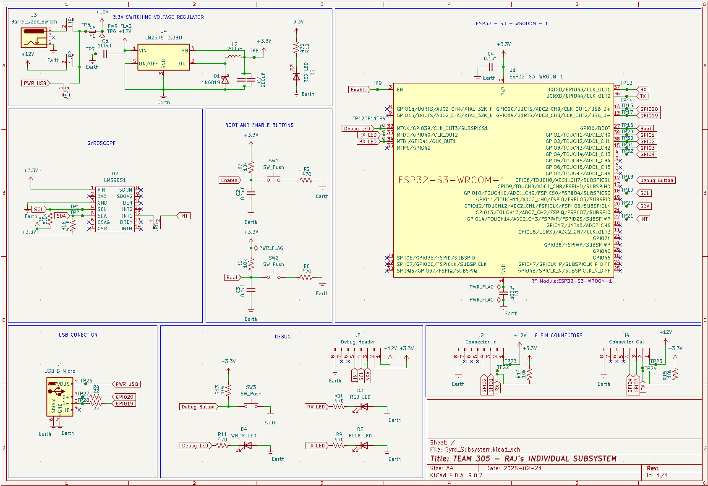

## Overview

This schematic captures the navigation sensor subsystem for Team 305: a 9 V input is regulated to 3.3 V, which powers the ESP32-S3 microcontroller and the MPU-9250 gyroscope. The microcontroller communicates with the sensor over I2C, and a USB-C connector provides power and a serial/debug interface. An 8-pin header is included for expansion or inter-module connection.

{style width:"350" height:"300;"}
**Figure 1:** Team 305 — Raj's individual subsystem schematic (2026-02-21).

## Resources

The schematic as a PDF download is available [*here*](INTIALSUBMISSION.pdf). The Zip folder of the KiCad project is available [*here*](Gyro_Subsystem.zip).
