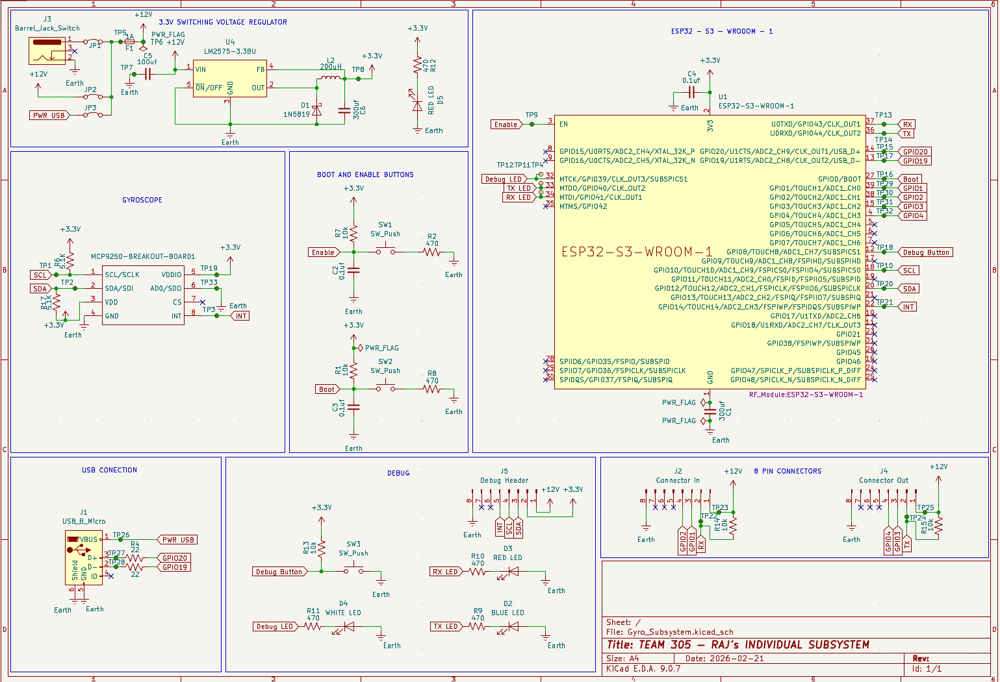
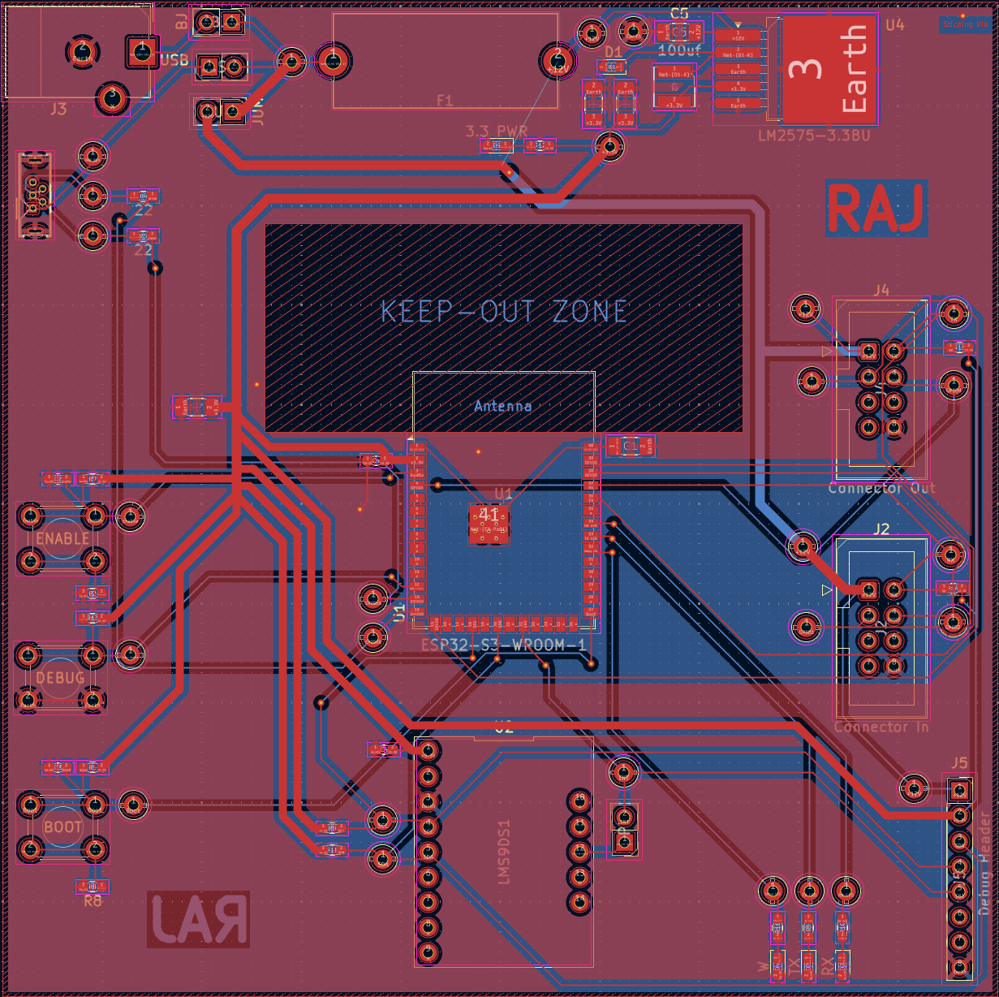
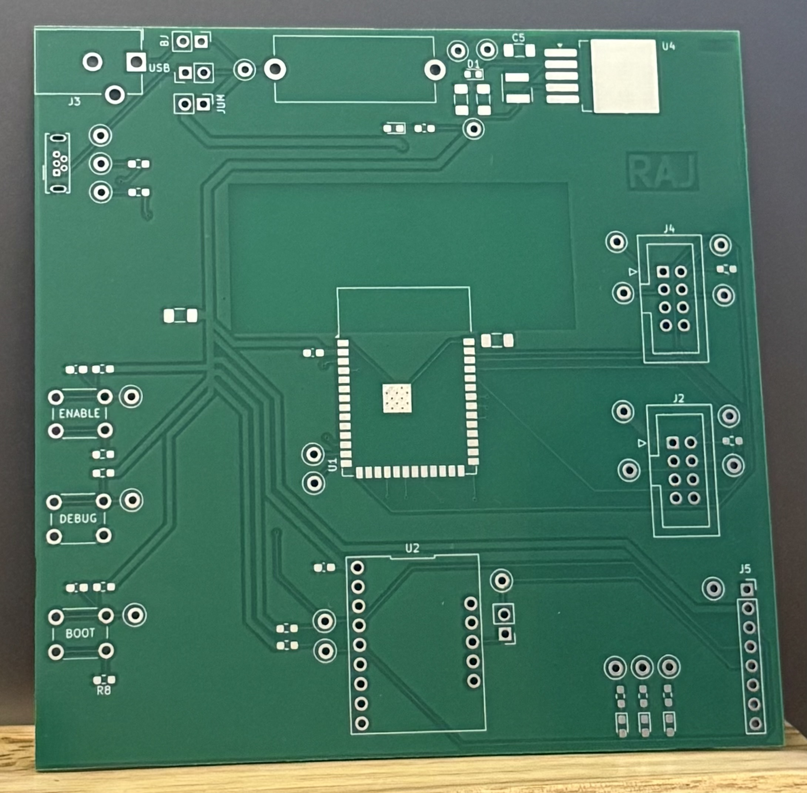
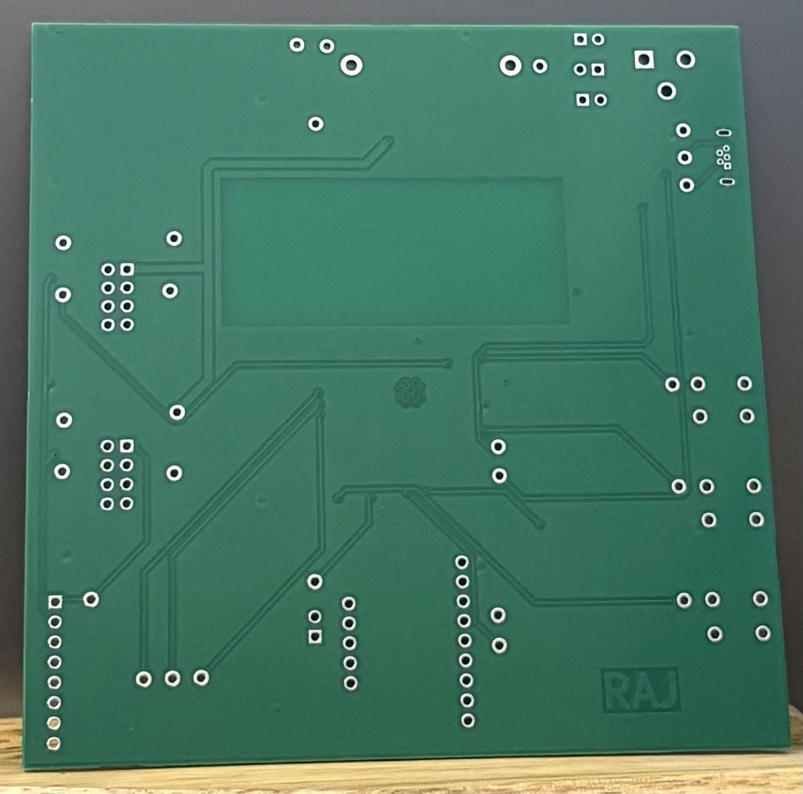
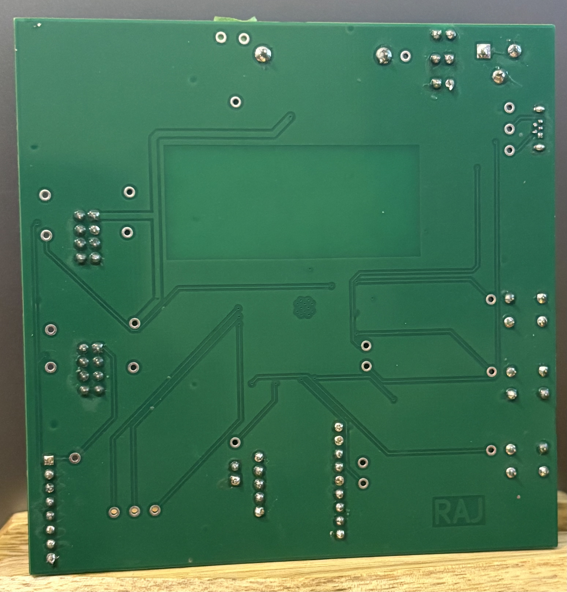

## Overview

This schematic captures the navigation sensor subsystem for Team 305: a 12V input is regulated to 3.3V, which powers the ESP32-S3 microcontroller and the Adafruit LSM9DS1 9-DOF IMU. The microcontroller communicates with the sensor over I2C, and a USB Micro-B connector provides a serial/debug interface. An 8-pin header is included for expansion or inter-module connection.

{style width:"350" height:"300;"}
**Figure 1:** Team 305 — Raj's individual subsystem schematic (2026-02-21).

## Resources

The schematic as a PDF download is available [*Schematic PDF*](INTIALSUBMISSION.pdf). The Zip folder of the KiCad project is available [*KiCad schematic archive*](Gyro_KICAD.zip).

{style width:"350" height:"300;"}
**Figure 2:** Team 305 — Raj's individual subsystem PCB layout (2026-04-09).

## Produced PCB

Photos of the manufactured board: bare **unsoldered** panels first, then the **soldered** assembly.

### Unsoldered

{style width:"350" height:"300;"}
**Figure 3:** Unsoldered board — component (front) side.

{style width:"350" height:"300;"}
**Figure 4:** Unsoldered board — solder (back) side.

### Soldered

{style width:"350" height:"300;"}
**Figure 5:** Soldered assembly — component (front) side.

{style width:"350" height:"300;"}
**Figure 6:** Soldered assembly — solder (back) side.

The PCB as a PDF download is available [*PCB PDF*](PCB SUBMISSION.pdf). The Zip folder of the KiCad PCB project is available [*KiCad PCB archive*](Gyro_KICAD.zip).
