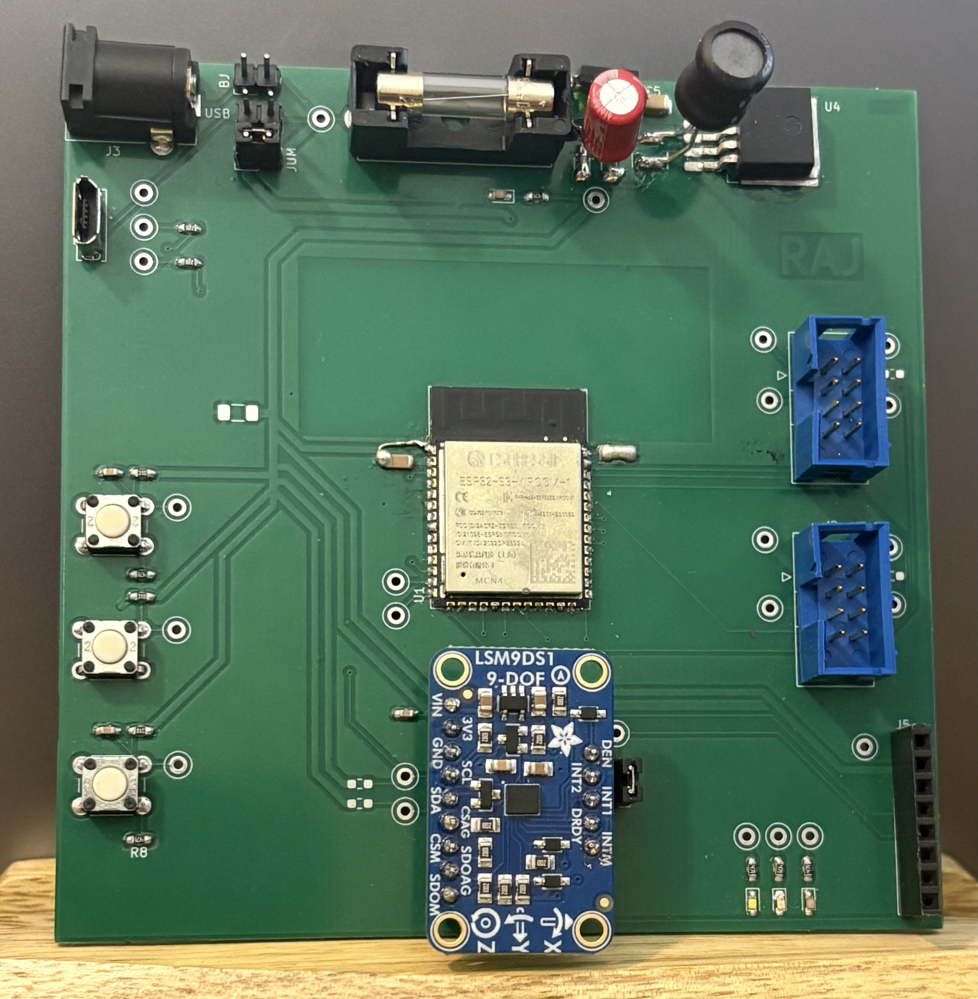

Ragul Raj's Datasheet 
as part of 
 Gyroscope Subsystem 
for 
 Team 305  

<figure class="home-hero" markdown="0">
  
</figure>

**Submission: May, 05, 2026**

## Introduction

This datasheet documents the design and implementation of the Gyroscope (Navigation Sensor) Subsystem for Team 305's rover project in EGR 314. The subsystem provides real-time orientation and motion data to the rover by integrating a 9-axis IMU with a WiFi-capable microcontroller. All major design decisions — component selection, power budgeting, schematic design, and PCB layout — are captured here as a standalone reference for this individual subsystem.

### Project Summary

Team 305 is developing a multi-module rover system where each team member is responsible for an individual subsystem. This subsystem focuses on **navigation sensing** — detecting the rover's tilt, acceleration, and heading using an inertial measurement unit (IMU). The module is built around the **ESP32-S3-WROOM-1** microcontroller and the **Adafruit LSM9DS1 Breakout** (9-axis gyroscope, accelerometer, magnetometer, and temperature sensor). The ESP32 communicates with the LSM9DS1 over **I2C** and relays orientation data to other rover subsystems via **UART**.

The power architecture uses a **12V DC barrel jack** input stepped down to **3.3V** through an **LM2575-3.3BU** buck regulator, supplying all active components on a single 3.3V rail. The design includes status LEDs, I2C pull-ups, overcurrent protection (1A fuse), and a USB Micro-B connector for programming and debug.

For the full team report, see the [Team 305 Report](https://egr314-s-2026-30.github.io/EGR314-S-2026-305.github.io/).

### My Contribution

I am responsible for the **IMU (Inertial Measurement Unit) subsystem** on Team 305. My work covers sensor integration, power regulation, and serial communication for the navigation module. The key areas of this datasheet are:

  * [Requirements](https://rrangasa.github.io/EGR314raj.github.io/01-Requirements/Requirements/) — Module requirements including power compatibility, sensor interface, and mechanical integration
  * [Block Diagram](https://rrangasa.github.io/EGR314raj.github.io/02-Block-Diagram/Block-Diagram/) — System-level block diagram showing the ESP32, LSM9DS1, power chain, and interconnections
  * [Major Components](https://rrangasa.github.io/EGR314raj.github.io/03-Component-Selection/Component-Selection/) — Selection and rationale for the voltage regulator, gyroscope sensor, and supporting components
  * [Microcontroller](https://rrangasa.github.io/EGR314raj.github.io/03-Component-Selection/Microcontroller/) — ESP32-S3-WROOM-1 selection, pin allocation, and peripheral compatibility analysis
  * [Power Budget](https://rrangasa.github.io/EGR314raj.github.io/03-Component-Selection/Power-Budget/) — Full power budget covering all 3.3V consumers, regulator efficiency, and worst-case/low-power analysis
  * [BOM](https://rrangasa.github.io/EGR314raj.github.io/04-BOM/BOM/) — Bill of materials for all components used in the subsystem
  * [Schematic and PCB](https://rrangasa.github.io/EGR314raj.github.io/05-Schematic/schematic/) — KiCad schematic and PCB layout with PDFs and project downloads
  * [Hardware V2.0](https://rrangasa.github.io/EGR314raj.github.io/06-Hardware-V2/Hardware-V2/) — Planned improvements for a second hardware revision, grounded in the current schematic and PCB
  * [API and Code / Message Spec](https://rrangasa.github.io/EGR314raj.github.io/08-API/API/) — UART message protocol, receiver/sender behavior, and downloadable firmware archive
  * [Resources](https://rrangasa.github.io/EGR314raj.github.io/Resources/Resources/) — Final ESP32/MPLab project ZIP and embedded demonstration video
  * [Reflection](https://rrangasa.github.io/EGR314raj.github.io/09-Reflection/Reflection/) — Module success review, startup tips, lessons learned, and advice for future students
